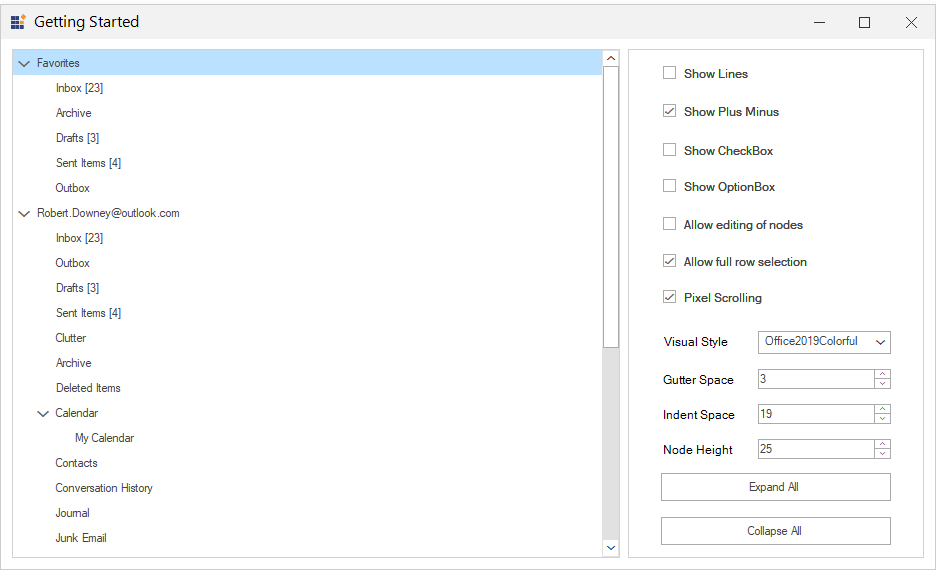

# WinForms TreeView Getting Started
[WinForms TreeViewAdv](https://www.syncfusion.com/winforms-ui-controls/treeview?utm_source=github&utm_medium=listing&utm_campaign=winforms-treeview-github-samples) displays a collection of data in hierarchical tree structure and the data in tree view can be expanded and collapsed. It offers many features like drag-and-drop, load on demand, context menus and data binding. The control comes with complete design time support.

Take a moment to peruse the [WinForms TreeView documentation]( https://help.syncfusion.com/windowsforms/treeview/overview), where you can find about TreeViewAdv with code examples.

## Features and Benefits

## Selection modes
Single or multiple nodes can be selected in a treeview. Selected nodes can be dragged within or outside the tree using OLE drag-and-drop. While using multiple-selection mode, you can specify whether to allow nodes to be selected within the same level or across different levels.

## Load on demand
The advanced TreeView control can display large amounts of data. It lets users bind trees to huge data sets and load and expand nodes on demand.

## Context menus
Display a context menu by right-clicking a tree node.

## Appearance customization
The Tree View control comes with several appearance and layout customization options to tailor the look and feel of nodes.

## Custom checkbox and radio button

Users can draw their own checkboxes and radio buttons inside a tree node.

## Editing
The labels of individual tree nodes can be edited at run-time. The following illustrates a node label being edited.

[Editing documentation](https://help.syncfusion.com/windowsforms/treeview/editing?utm_source=github&utm_medium=listing&utm_campaign=winforms-treeview-github-samples)

## Styling
The [style architecture](https://help.syncfusion.com/windowsforms/treeview/styles-architecture?utm_source=github&utm_medium=listing&utm_campaign=winforms-treeview-github-samples) employed by the advanced TreeView control lets users define unique styles for different parts of a tree. Each node then inherits these different styles before being rendered. The different styles users can specify in the tree by order of inheritance are:
- Global: Defined in a tree view instance
- Child: Defined in a parent node that applies to all immediate children of the parent node.
- Node level: Defined for nodes at a particular level in the tree.
- Node specific: Defined in each node.
In addition, users can define base styles that can be inherited when defining any of these styles.teams

## Sorting
Sort nodes at any level using the text, check box, and tag properties, or customize the sort key on which sorting is performed.

[Sorting documentation](https://help.syncfusion.com/windowsforms/treeview/sorting?utm_source=github&utm_medium=listing&utm_campaign=winforms-treeview-github-samples)

## Printing
Use [TreeViewPrintDocument](https://help.syncfusion.com/cr/windowsforms/Syncfusion.Windows.Forms.Tools.TreeViewPrintDocument.html?utm_source=github&utm_medium=listing&utm_campaign=winforms-treeview-github-samples) to convert the TreeView content into a printable document.

[Printing documentation](https://help.syncfusion.com/windowsforms/treeview/printing?utm_source=github&utm_medium=listing&utm_campaign=winforms-treeview-github-samples)

## XML
The advanced TreeView control's architecture provides a seamless way to consume information from hierarchical data sources, and display it. This allows users to bind XML data from a variety of sources such as external XML files, and data set objects.

## Search
[Search and replace](https://help.syncfusion.com/windowsforms/treeview/find-and-replace?utm_source=github&utm_medium=listing&utm_campaign=winforms-treeview-github-samples) in a specific tree node.

## Related links
[Learn More about WinForms TreeView](https://www.syncfusion.com/winforms-ui-controls/treeview?utm_source=github&utm_medium=listing&utm_campaign=winforms-treeview-github-samples)

[Download Free Trial](https://www.syncfusion.com/downloads/windowsforms?utm_source=github&utm_medium=listing&utm_campaign=winforms-treeview-github-samples)

[Pricing](https://www.syncfusion.com/sales/products/windowsforms?utm_source=github&utm_medium=listing&utm_campaign=winforms-treeview-github-samples)

[Documentation](https://help.syncfusion.com/windowsforms/treeview/getting-started?utm_source=github&utm_medium=listing&utm_campaign=winforms-treeview-github-samples)

[View Demos](https://github.com/syncfusion/winforms-demos/tree/master/treeview?utm_source=github&utm_medium=listing&utm_campaign=winforms-treeview-github-samples)

[Community Forums](https://www.syncfusion.com/forums/windowsforms?utm_source=github&utm_medium=listing&utm_campaign=winforms-treeview-github-samples)

[Suggest a feature or report a bug](https://www.syncfusion.com/feedback/winforms?utm_source=github&utm_medium=listing&utm_campaign=winforms-treeview-github-samples)

[Samples](https://github.com/syncfusion/winforms-demos/tree/master/treeview.Windows/Samples?utm_source=github&utm_medium=listing&utm_campaign=winforms-treeview-github-samples)

[Knowledge base](https://www.syncfusion.com/kb/windowsforms?utm_source=github&utm_medium=listing&utm_campaign=winforms-treeview-github-samples)

## About Syncfusion WinForms UI Controls
Syncfusion's [WinForms UI controls](https://www.syncfusion.com/winforms-ui-controls?utm_source=github&utm_medium=listing&utm_campaign=winforms-treeview-github-samples) library is the only suite that you will ever need to build an application since it contains over 100 high-performance, lightweight, modular, and responsive UI Components in a single package. In addition to TreeView, we provide popular WinForms Controls such as [DataGrid](https://www.syncfusion.com/winforms-ui-controls/datagrid?utm_source=github&utm_medium=listing&utm_campaign=winforms-treeview-github-samples), [Charts](https://www.syncfusion.com/WinForms-ui-controls/chart?utm_source=github&utm_medium=listing&utm_campaign=winforms-treeview-github-samples) [Scheduler](https://www.syncfusion.com/winforms-ui-controls/scheduler?utm_source=github&utm_medium=listing&utm_campaign=winforms-treeview-github-samples),and [Syntax editor](https://www.syncfusion.com/winforms-ui-controls/syntax-editor?utm_source=github&utm_medium=listing&utm_campaign=winforms-treeview-github-samples)

## About Syncfusion

Founded in 2001 and headquartered in Research Triangle Park, N.C., Syncfusion has more than 27,000 customers and more than 1 million users, including large financial institutions, Fortune 500 companies, and global IT consultancies.
 
Today we provide 1700+ controls and frameworks for web ([Blazor](https://www.syncfusion.com/blazor-components?utm_source=github&utm_medium=listing&utm_campaign=winforms-treeview-github-samples), [ASP.NET Core](https://www.syncfusion.com/aspnet-core-ui-controls?utm_source=github&utm_medium=listing&utm_campaign=winforms-treeview-github-samples), [ASP.NET MVC](https://www.syncfusion.com/aspnet-mvc-ui-controls?utm_source=github&utm_medium=listing&utm_campaign=winforms-treeview-github-samples), [ASP.NET WebForms](https://www.syncfusion.com/jquery/aspnet-web-forms-ui-controls?utm_source=github&utm_medium=listing&utm_campaign=winforms-treeview-github-samples), [JavaScript](https://www.syncfusion.com/javascript-ui-controls?utm_source=github&utm_medium=listing&utm_campaign=winforms-treeview-github-samples), [Angular](https://www.syncfusion.com/angular-ui-components?utm_source=github&utm_medium=listing&utm_campaign=winforms-treeview-github-samples), [React](https://www.syncfusion.com/react-ui-components?utm_source=github&utm_medium=listing&utm_campaign=winforms--github-samples), [Vue](https://www.syncfusion.com/vue-ui-components?utm_source=github&utm_medium=listing&utm_campaign=winforms-treeview-github-samples), and [Flutter](https://www.syncfusion.com/flutter-widgets?utm_source=github&utm_medium=listing&utm_campaign=winforms-treeview-github-samples)), mobile ([Xamarin](https://www.syncfusion.com/xamarin-ui-controls?utm_source=github&utm_medium=listing&utm_campaign=winforms-treeview-github-samples), [Flutter](https://www.syncfusion.com/flutter-widgets?utm_source=github&utm_medium=listing&utm_campaign=winforms-treeview-github-samples), [UWP](https://www.syncfusion.com/uwp-ui-controls?utm_source=github&utm_medium=listing&utm_campaign=winforms-treeview-github-samples) and 
Today we provide 1700+ controls and frameworks for web ([Blazor](https://www.syncfusion.com/blazor-components?utm_source=github&utm_medium=listing&utm_campaign=winforms-treeview-github-samples), [ASP.NET Core](https://www.syncfusion.com/aspnet-core-ui-controls?utm_source=github&utm_medium=listing&utm_campaign=winforms-treeview-github-samples), [ASP.NET MVC](https://www.syncfusion.com/aspnet-mvc-ui-controls?utm_source=github&utm_medium=listing&utm_campaign=winforms-treeview-github-samples), [ASP.NET WebForms](https://www.syncfusion.com/jquery/aspnet-web-forms-ui-controls?utm_source=github&utm_medium=listing&utm_campaign=winforms-treeview-github-samples), [JavaScript](https://www.syncfusion.com/javascript-ui-controls?utm_source=github&utm_medium=listing&utm_campaign=winforms-treeview-github-samples), [Angular](https://www.syncfusion.com/angular-ui-components?utm_source=github&utm_medium=listing&utm_campaign=winforms-treeview-github-samples), [React](https://www.syncfusion.com/react-ui-components?utm_source=github&utm_medium=listing&utm_campaign=winforms-github-samples), [Vue](https://www.syncfusion.com/vue-ui-components?utm_source=github&utm_medium=listing&utm_campaign=winforms-treeview-github-samples), and [Flutter](https://www.syncfusion.com/flutter-widgets?utm_source=github&utm_medium=listing&utm_campaign=winforms-treeview-github-samples)), mobile ([Xamarin](https://www.syncfusion.com/xamarin-ui-controls?utm_source=github&utm_medium=listing&utm_campaign=winforms-treeview-github-samples), [Flutter](https://www.syncfusion.com/flutter-widgets?utm_source=github&utm_medium=listing&utm_campaign=winforms-treeview-github-samples), [UWP](https://www.syncfusion.com/uwp-ui-controls?utm_source=github&utm_medium=listing&utm_campaign=winforms-treeview-github-samples) and 
Today we provide 1700+ controls and frameworks for web ([Blazor](https://www.syncfusion.com/blazor-components?utm_source=github&utm_medium=listing&utm_campaign=winforms-treeview-github-samples), [ASP.NET Core](https://www.syncfusion.com/aspnet-core-ui-controls?utm_source=github&utm_medium=listing&utm_campaign=winforms-treeview-github-samples), [ASP.NET MVC](https://www.syncfusion.com/aspnet-mvc-ui-controls?utm_source=github&utm_medium=listing&utm_campaign=winforms-treeview-github-samples), [ASP.NET WebForms](https://www.syncfusion.com/jquery/aspnet-web-forms-ui-controls?utm_source=github&utm_medium=listing&utm_campaign=winforms-treeview-github-samples), [JavaScript](https://www.syncfusion.com/javascript-ui-controls?utm_source=github&utm_medium=listing&utm_campaign=winforms-treeview-github-samples), [Angular](https://www.syncfusion.com/angular-ui-components?utm_source=github&utm_medium=listing&utm_campaign=winforms-treeview-github-samples), [React](https://www.syncfusion.com/react-ui-components?utm_source=github&utm_medium=listing&utm_campaign=winforms-treeview-github-samples), [Vue](https://www.syncfusion.com/vue-ui-components?utm_source=github&utm_medium=listing&utm_campaign=winforms-treeview-github-samples), and [Flutter](https://www.syncfusion.com/flutter-widgets?utm_source=github&utm_medium=listing&utm_campaign=winforms-treeview-github-samples)), mobile ([Xamarin](https://www.syncfusion.com/xamarin-ui-controls?utm_source=github&utm_medium=listing&utm_campaign=winforms-treeview-github-samples), [Flutter](https://www.syncfusion.com/flutter-widgets?utm_source=github&utm_medium=listing&utm_campaign=winforms-treeview-github-samples), [UWP](https://www.syncfusion.com/uwp-ui-controls?utm_source=github&utm_medium=listing&utm_campaign=winforms-treeview-github-samples) and 
[JavaScript](https://www.syncfusion.com/javascript-ui-controls?utm_source=github&utm_medium=listing&utm_campaign=winforms-treeview-github-samples), and [MAUI(Preview)](https://www.syncfusion.com/maui-controls?utm_source=github&utm_medium=listing&utm_campaign=winforms-treeview-github-samples)), and desktop development ( [WinForms](https://www.syncfusion.com/winforms-ui-controls?utm_source=github&utm_medium=listing&utm_campaign=winforms-treeview-github-samples), [WPF](https://www.syncfusion.com/wpf-ui-controls?utm_source=github&utm_medium=listing&utm_campaign=winforms-treeview-github-samples), [WinUI(Preview)](https://www.syncfusion.com/winui-controls?utm_source=github&utm_medium=listing&utm_campaign=winforms-treeview-github-samples), [UWP](https://www.syncfusion.com/uwp-ui-controls?utm_source=github&utm_medium=listing&utm_campaign=winforms-treeview-github-samples), [Flutter](https://www.syncfusion.com/flutter-widgets?utm_source=github&utm_medium=listing&utm_campaign=winforms-treeview-github-samples)). and[MAUI(Preview)](https://www.syncfusion.com/maui-controls?utm_source=github&utm_medium=listing&utm_campaign=winforms-treeview-github-samples)). We provide ready-to deploy enterprise software for dashboards, reports, data integration, and big data processing. Many customers have saved millions in licensing fees by deploying our software.

  <a href="mailto:sales@syncfusion.com?Subject=Syncfusion WinForms Treeview - GitHub" target="_top">sales@syncfusion.com</a>   | <a href="https://www.syncfusion.com?utm_source=github&utm_medium=listing&utm_campaign=winforms-treeview-github-samples">www.syncfusion.com</a>  | Toll Free: 1-888-9 DOTNET  

