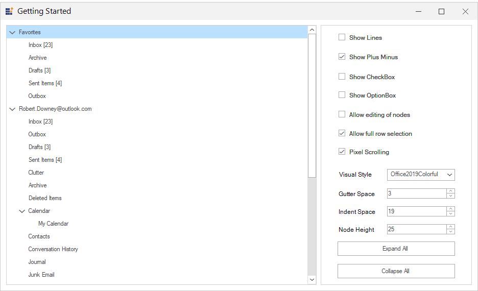

# WinForms TreeView Getting Started

[TreeViewAdv](https://www.syncfusion.com/winforms-ui-controls/treeview) displays a collection of data in hierarchical tree structure and the data in tree view can be expanded and collapsed. It offers many features like drag-and-drop, load on demand, context menus and data binding. The control comes with complete design time support.



## Customize Nodes

TreeViewAdv provides customization options to control the appearance and behavior of nodes with visual elements such as lines, expand/collapse buttons, checkboxes, and option buttons.

### Root Lines

Display connecting lines between nodes using `ShowRootLines` and `ShowLines` properties. Both are set to `true` by default.

When `TreeViewAdv.ShowLines` is set to false, the connecting lines will not be displayed for the entire control.

```csharp
// Hide connecting lines
this.treeViewAdv1.ShowLines = false;
```

### Plus/Minus

We can display Plus/Minus sign for the parent nodes by setting the property `TreeViewAdv.ShowPlusMinus` to True. This will set Plus/Minus sign for all the parent nodes in TreeViewAdv.
We can also set this for nodes using `TreeNodeAdv.ShowPlusMinus` property in the `TreeNodeAdv`.

The nodes in the `TreeViewAdv`, even when it is in the expanded state, can still display the Plus sign using the `TreeNodeAdv.ShowPlusOnExpand` property. `TreeViewAdv.LoadOnDemand` property should be set to true for this feature to be effective.

```csharp
this.treeViewAdv1.ShowPlusMinus = false;
```

### CheckBox

We can display CheckBox for all nodes in `TreeViewAdv` by setting `TreeViewAdv.ShowCheckBoxes` property to `True`. The CheckBox for individual nodes can also be shown or hidden using `TreeNodeAdv.ShowCheckBox` property in `TreeNodeAdv`.

```csharp
this.treeViewAdv1.ShowCheckBoxes = false;
treeNode.ShowCheckBox = true;
```

### OptionButton

The Option Buttons can be displayed for the nodes in the `TreeViewAdv` using the `TreeViewAdv.ShowOptionButtons` property. We can also show or hide the Option Button for individual nodes using `TreeNodeAdv.ShowOptionButton` property in the `TreeNodeAdv`.

```csharp
this.treeViewAdv1.ShowOptionButtons = false;
treeNode.ShowOptionButton = true;
```

### Assigning Active Nodes

The `TreeViewAdv.ActiveNode` property holds the currently selected node. By default, it is `null` when no node is selected.

### Documentation
Take a moment to peruse the [WinForms TreeView documentation](https://help.syncfusion.com/windowsforms/treeview/overview), where you can find about TreeViewAdv with code examples.